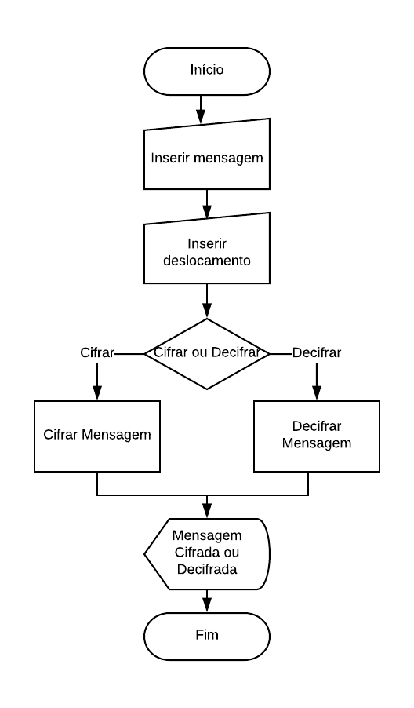

# Projeto Cipher

O objetivo é desenvolver um projeto que seja capaz de cifrar e decifrar mensagens, utilizando o método da Cifra de Cezar e somente Vanilla JS.
O usuário inseri a mensagem que deseja cifrar ou decifrar e informa o deslocamento desejado do alfabeto. O programa faz a codificação somente das letras independentemente se estas são maiúsculas ou minúsculas, e mantém os caracteres especiais, números e espaços. Além de deslocamentos positivos, o usuário consegue fazer deslocamentos com números negativos. 

